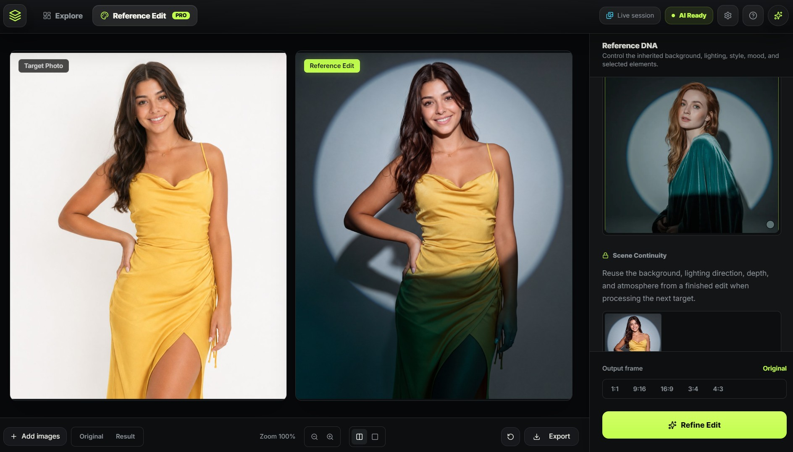

# ISTUDIO by Iconic Recordings



ISTUDIO is a Windows-first reference-based photo editing app. It lets creators edit target photos from the visual DNA of another image for background replacement, relighting, style transfer, and fine element control.

## Download And Install

[Download the one-click Windows installer](https://github.com/metadreamx/ISTUDIO/releases/latest/download/LAUNCH-ISTUDIO.bat)

Place `LAUNCH-ISTUDIO.bat` in the folder where you want ISTUDIO installed, then double-click it. The installer creates an `ISTUDIO` folder beside the BAT, installs the complete app there, and starts ISTUDIO.

Users do not need to install anything else. The release package includes everything ISTUDIO needs to run.

## Use ISTUDIO

1. Open the desktop shortcut or `LAUNCH ISTUDIO.bat` inside the installed ISTUDIO folder.
2. ISTUDIO starts automatically.
3. Import a reference image that contains the lighting, mood, style, or scene DNA you want.
4. Add target photos.
5. Refine the edit and export the finished result.

For the maintenance menu, run:

```powershell
.\LAUNCH-ISTUDIO.bat menu
```

The menu includes:

- `Check for updates`
- `Open projects folder`
- `Exit`

## Project Storage

Installed projects are saved inside the ISTUDIO folder beside the launcher:

```text
<folder with LAUNCH-ISTUDIO.bat>\ISTUDIO\projects
```

Project data stays on the user's computer. Updates preserve projects and `.env.local`.

## Updates

ISTUDIO updates are published through GitHub Releases.

```powershell
.\LAUNCH-ISTUDIO.bat menu
```

The maintenance menu can check for updates and open the local projects folder. Releases show the installer BAT plus GitHub's source-code downloads:

- `LAUNCH-ISTUDIO.bat`
